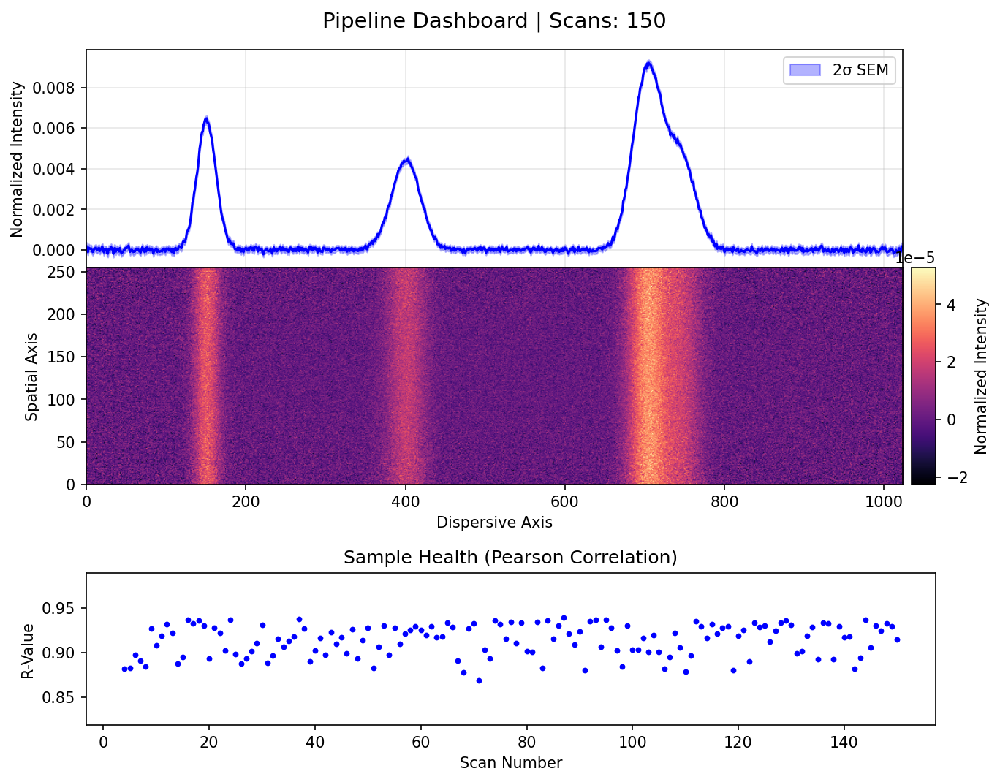
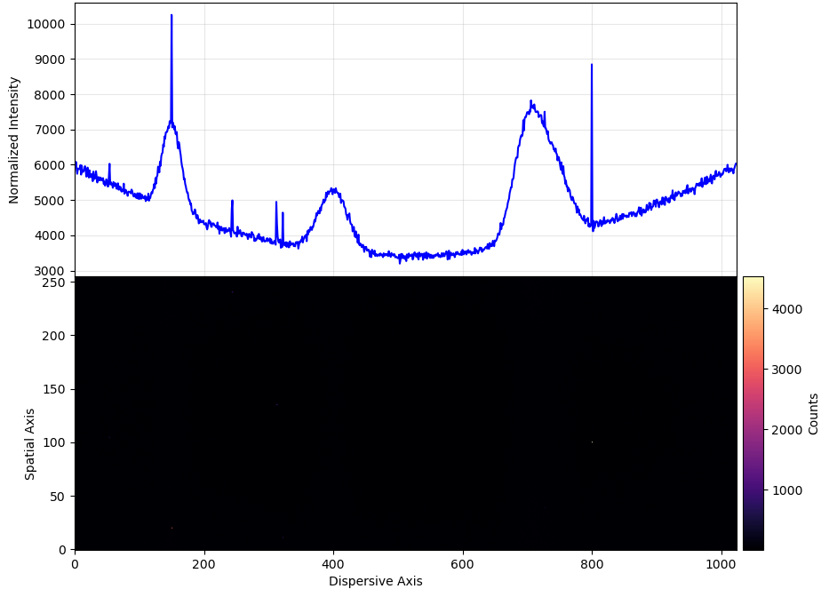
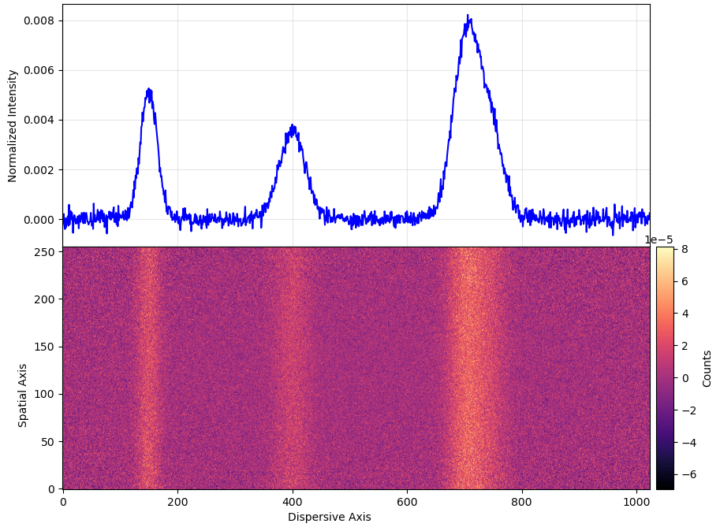
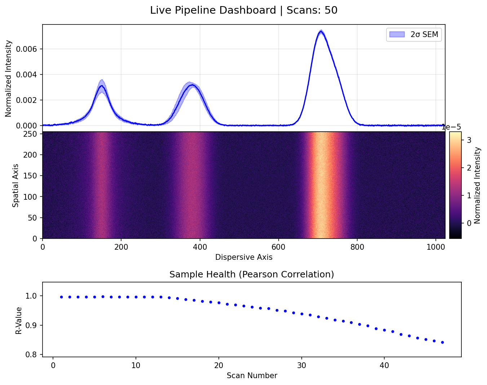
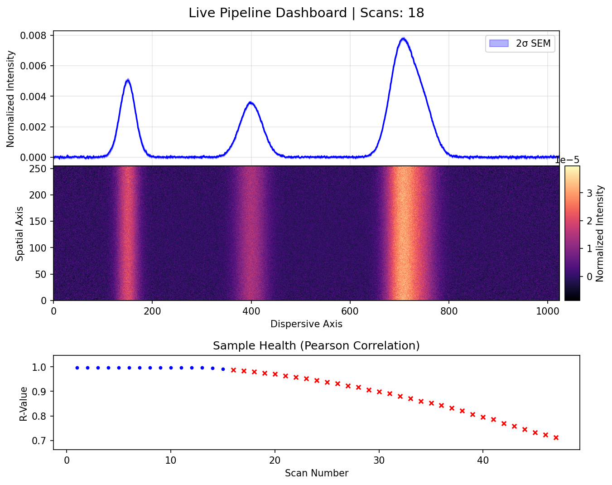
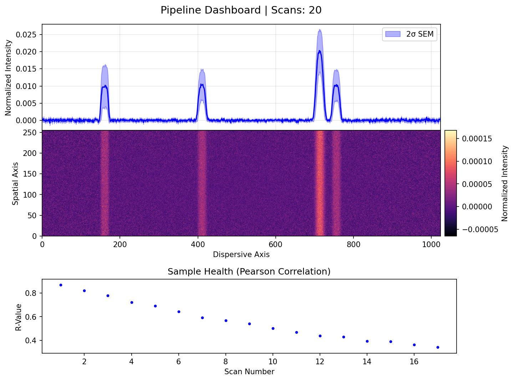
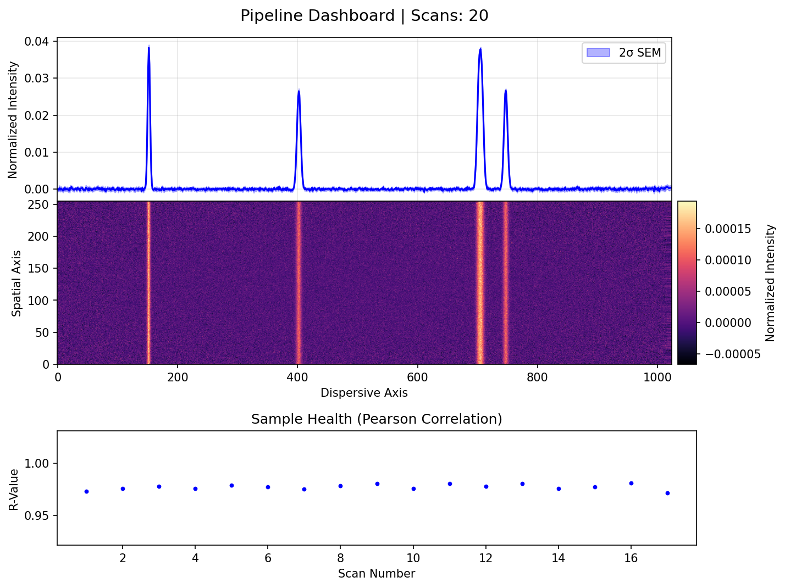

# 2D Detector Pipeline
**Version: v1.0.0**

A Python-based data reduction pipeline for real-time processing of 2D images. 

Built for continuous scanning environments at synchrotron beamlines, this script uses `watchdog` to monitor a target directory and processes incoming files (HDF5, TIFF, SIF, NPY) as they are written. It applies sub-pixel image registration to correct for sample drift and uses Welford's online algorithm to compute the running mean and standard error of the mean (SEM) without loading the entire dataset into RAM.

<br>
*Dashboard showing the 1D profile, 2D heatmap, and scan correlation.*

## Key Features

* **Sub-pixel Alignment:** Fits a 1D Gaussian to the data and applies a 2D shift to correct for drift during long exposures.
* **Cosmic Ray Rejection:** Applies a sparse uniform/median filter to remove high-intensity anomalies before integration.
* **Automated Scan Rejection:** Calculates the Pearson-R correlation of incoming scans against the running average. Scans falling below the defined threshold (e.g., beam dumps or shutter misfires) are excluded from the average.
* **Low Memory Footprint:** Uses  Welford accumulator to handle thousands of images with a constant, minimal RAM requirement.
* **Hardware Agnostic:** Dispersion axis (vertical or horizontal) and regions of interest are configured via YAML.

## Examples

### Background Subtraction & Despiking
The can easily background subtract and despike data. 

<br>
*Raw data with hot pixels and background distortion* 

<br>
*Data after background subtraction and removing cosmic rays / hot pixels*

### Shape Correlation
Pearson's R coefficient is used to analyze shape comparison to the running average, with built in cold-start (ie shutter closed on scan 1) safeties. 

<br>
*Here is the data with no rejection, showing obvious degredation of sample integrity currently being included in the average.*

<br>
*And here is the same data with a R= 0.98 as a treshhold. R can be set by the user to the desired value depending on how noisy the data is.*

### Automatic Alignment
The script can be set to align to certain features, such as an elastic line, to account for any drift.

<br>
*Here is data without automatic alignment, showing the effects of drift on the spectra*

<br>
*Here is the same data with the automatic alignment with a window set around the first peak*

## Jupyter Notebook Integration

The pipeline's core mathematical and plotting functions are decoupled from the monitoring engine. <br>
*See 'Example_analysis.ipynb' for a demonstration*

## Installation
Clone the repository and install the dependencies:

```bash
git clone [https://github.com/drice987/detector-pipeline.git](https://github.com/drice987/detector-pipeline.git)
cd detector-pipeline
pip install -r requirements.txt

Note: If your detector uses proprietary data formats, uncomment tifffile and/or sif_parser in requirements.txt before installing.
Usage

    Copy config.yaml and adjust the detector dimensions, crop boundaries, and integration axis for your setup.

    Run the pipeline:

Bash

python spectroscopy_pipeline.py

    Route your detector output to the watch_dir specified in your config.

The script will automatically update an averaged file (.h5) and a dashboard image (.png) as new data arrives.

Configuration

All pipeline parameters—including expected peak centers, despiking thresholds, and dark frame subtraction—are managed in config.yaml. 
```
## License
This project is licensed under the MIT License - see the [LICENSE](LICENSE) file for details.
